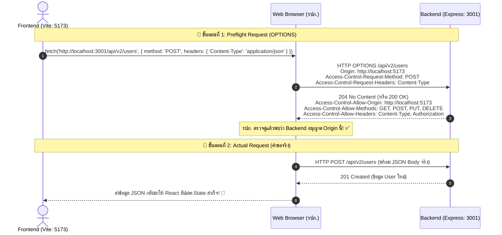

# 🌐 คู่มือเจาะลึก CORS (Cross-Origin Resource Sharing) ฉบับมือใหม่เข้าใจง่าย

[⬅️ กลับสู่สารบัญหลัก](file:///c:/Users/DoctorDear/Code/JSD13/week-10/jsd-mono-repo/backend/doc/README.md)

---

## 1. CORS คืออะไร? ทำไมชีวิต Web Developer ต้องเจอ Error สีแดงนี้?

สำหรับคนที่เริ่มทำเว็บแบบแยก **Frontend** (เช่น React, Vue, Svelte) กับ **Backend** (เช่น Express, Fastify, NestJS) เชื่อว่า 100 ทั้ง 100 ต้องเคยเจอข้อความสีแดงบาดใจใน Browser Console:

```text
Access to fetch at 'http://localhost:3001/api/v1/users' from origin 'http://localhost:5173' 
has been blocked by CORS policy: No 'Access-Control-Allow-Origin' header is present on the requested resource.
```

### 🏢 เปรียบเทียบให้เห็นภาพ (Analogy)
ลองจินตนาการสถานการณ์นี้:
- **Frontend (Vite / React)** = **คุณ** (อาศัยอยู่ที่ *คอนโด A* พอร์ต `5173`)
- **Backend (Express)** = **ร้านสะดวกซื้อ** (ตั้งอยู่ที่ *ซอย B* พอร์ต `3001`)
- **Web Browser (Chrome, Edge, Safari)** = **รปภ. ส่วนตัวสุดเฮี้ยบ** ที่เดินตามคุณตลอดเวลา

เมื่อคุณบอกรปภ. ว่า: *"ช่วยเดินไปหยิบของจากร้านซอย B ให้หน่อย"*  
รปภ. จะเดินไปดูที่ร้านซอย B แล้วมองหา **"ป้ายอนุญาตหน้าร้าน"**:
- **ถ้ามีป้ายเขียนว่า**: *"ยินดีต้อนรับคนจากคอนโด A"* ➔ รปภ. จะยอมรับของแล้วนำมาส่งให้คุณอย่างปลอดภัย ✅
- **ถ้าไม่มีป้าย หรือเขียนชื่อคอนโดอื่น**: รปภ. จะโยนของทิ้งทันที พร้อมตะโกนแจ้งคุณว่า **"Blocked by CORS policy!"** ❌

> [!IMPORTANT]
> **กฎเหล็กที่ต้องจำให้ขึ้นใจ**:
> 1. CORS **ไม่ใช่ข้อผิดพลาดของเซิร์ฟเวอร์** (Server ทำงานปกติ ข้อมูลถูกส่งออกมาแล้ว)
> 2. CORS เป็น **กลไกความปลอดภัยของ Web Browser** (Browser เป็นคนดักจับและบล็อก ไม่ให้ JavaScript ในหน้าเว็บเข้าถึงข้อมูล)

---

## 2. ทำความรู้จัก Same-Origin Policy (SOP) และคำว่า "Origin"

เบราว์เซอร์มีนโยบายความปลอดภัยพื้นฐานที่เรียกว่า **Same-Origin Policy (SOP)** เพื่อป้องกันไม่ให้เว็บไซต์ไม่หวังดี (Malicious Website) แอบยิง Request ข้ามไปขโมยข้อมูลส่วนตัวจากเว็บไซต์อื่นที่คุณกำลังเปิดค้างไว้อยู่ (เช่น เว็บธนาคาร หรือ Social Media)

### องค์ประกอบของ "Origin" (ต้นทาง)
คำว่า **Origin** ประกอบด้วย 3 องค์ประกอบหลัก:

```text
  http://  localhost  :5173
  └─┬──┘   └───┬───┘  └──┬─┘
  Scheme     Host      Port
(Protocol)
```

หากส่วนใดส่วนหนึ่งต่างกันแม้แต่นิดเดียว เบราว์เซอร์จะถือว่าเป็น **Cross-Origin** ทันที!

### 📊 ตารางเปรียบเทียบ Origin กับ `http://localhost:5173`

| URL เป้าหมาย | ผลลัพธ์ | สาเหตุ |
| :--- | :---: | :--- |
| `http://localhost:5173/api/data` | ✅ **Same-Origin** | Scheme, Host, Port เหมือนกันทุกประการ |
| `http://localhost:3001/api/users` | ❌ **Cross-Origin** | **Port ต่างกัน** (`5173` vs `3001`) — *เคสของโปรเจกต์เรา!* |
| `https://localhost:5173/api/data` | ❌ **Cross-Origin** | **Scheme ต่างกัน** (`http` vs `https`) |
| `http://127.0.0.1:5173/api/data` | ❌ **Cross-Origin** | **Host ต่างกัน** แม้จะชี้ไปที่เครื่องเดียวกัน แต่ Browser มองเป็นคนละตัวอักษร |
| `http://api.myapp.com:80` vs `http://myapp.com:80` | ❌ **Cross-Origin** | **Subdomain ต่างกัน** |

---

## 3. กลไกการทำงานของ CORS (Request Types)

เบราว์เซอร์จะแบ่ง HTTP Request ออกเป็น 2 ประเภทหลัก:

### 1) Simple Request (คำขอแบบธรรมดา)
เป็นคำขอที่ปลอดภัยและไม่เปลี่ยนแปลงโครงสร้าง เช่น:
- ใช้ HTTP Method: `GET`, `POST`, หรือ `HEAD`
- Headers เป็นแบบมาตรฐาน (เช่น `Accept`, `Accept-Language`, `Content-Language`)
- `Content-Type` เป็นเพียง: `text/plain`, `multipart/form-data`, หรือ `application/x-www-form-urlencoded`

**ขั้นตอนการทำงาน**:
1. Browser ส่ง Request ไปที่ Server ทันที พร้อมแนบ Header `Origin: http://localhost:5173`
2. Server ได้รับและส่งข้อมูลกลับมา พร้อม Response Header `Access-Control-Allow-Origin: http://localhost:5173` (หรือ `*`)
3. Browser ตรวจสอบ ถ้า Header อนุญาตถูกต้อง ➔ ส่งข้อมูลให้โค้ด JavaScript ใน Frontend ใช้งาน

---

### 2) Preflight Request (การบินสำรวจล่วงหน้าด้วย `OPTIONS`)
เมื่อใดก็ตามที่มีการส่งข้อมูลที่มีความซับซ้อน เช่น:
- ใช้ Method: `PUT`, `DELETE`, `PATCH`
- ส่ง `Content-Type: application/json` *(ที่เราใช้กันประจำในการทำ REST API!)*
- มีการแนบ Custom Headers เช่น `Authorization: Bearer <token>`

เบราว์เซอร์จะไม่ส่งคำขอจริงไปทันที เพราะเกรงว่าคำสั่ง `DELETE` หรือ `PUT` อาจไปแก้ไขข้อมูลบนเซิร์ฟเวอร์ก่อนได้รับอนุญาต!  
เบราว์เซอร์จึงส่งคำขอพิเศษแบบ **HTTP Method `OPTIONS`** ไปเคาะประตูถามเซิร์ฟเวอร์ก่อน เรียกว่า **Preflight Request**



---

## 4. HTTP Headers สำคัญที่เกี่ยวข้องกับ CORS

### 📤 Request Headers (ฝั่ง Browser ส่งไปถาม)
- **`Origin`**: โดเมนของหน้าเว็บต้นทางที่ส่งคำขอมา (เช่น `http://localhost:5173`)
- **`Access-Control-Request-Method`**: บอกเซิร์ฟเวอร์ล่วงหน้าว่าคำขอจริงจะใช้ Method อะไร (เช่น `POST`, `DELETE`)
- **`Access-Control-Request-Headers`**: บอกเซิร์ฟเวอร์ล่วงหน้าว่าจะแนบ Custom Header อะไรมาบ้าง (เช่น `Content-Type`, `Authorization`)

### 📥 Response Headers (ฝั่ง Server ส่งตอบกลับมา)
- **`Access-Control-Allow-Origin`**: ระบุว่า Origin ใดบ้างที่มีสิทธิ์อ่าน Response นี้ (เช่น `http://localhost:5173` หรือ `*` สำหรับทุกคน)
- **`Access-Control-Allow-Methods`**: เมธอดใดบ้างที่เซิร์ฟเวอร์อนุญาต (เช่น `GET, POST, PUT, DELETE, OPTIONS`)
- **`Access-Control-Allow-Headers`**: Header ใดบ้างที่ไคลเอนต์ส่งมาได้ (เช่น `Content-Type, Authorization`)
- **`Access-Control-Allow-Credentials`**: อนุญาตให้ส่ง Cookies หรือ Session หรือ Token แนบมาด้วยหรือไม่ (`true` / `false`)
- **`Access-Control-Max-Age`**: สั่งให้ Browser จดจำ (Cache) ผลลัพธ์ของ Preflight Request นานกี่วินาที เพื่อจะได้ไม่ต้องยิง `OPTIONS` ซ้ำๆ ทุกครั้ง

---

## 5. เจาะลึกโค้ด CORS ในโปรเจกต์นี้

ในโปรเจกต์ของเรา มีการแยกการตั้งค่า CORS ไว้อย่างเป็นระเบียบในโฟลเดอร์ `config`

### 1) ไฟล์ [`backend/src/config/cors.js`](file:///c:/Users/DoctorDear/Code/JSD13/week-10/jsd-mono-repo/backend/src/config/cors.js)

```javascript
const allowedOrigins = [
  process.env.CLIENT_URL || "http://localhost:5173", // 1. URL ของ Frontend Vite ในเครื่องเรา
  "http://localhost:3000", // 2. เผื่อกรณีรัน React ทั่วไป (เช่น Create React App)
];

export const corsOptions = {
  origin: (origin, callback) => {
    // 1. อนุญาต Request ที่ไม่มี Origin 
    //    (เช่น Postman, REST Client, mobile apps หรือ server-to-server)
    // 2. หรือถ้า Origin นั้นอยู่ในรายการ allowedOrigins ที่เรากำหนดไว้
    if (!origin || allowedOrigins.includes(origin)) {
      callback(null, true); // ✅ อนุญาตให้ผ่านได้
    } else {
      callback(new Error(`Not allowed by CORS: ${origin}`)); // ❌ ปฏิเสธคำขอ
    }
  },
  credentials: true, // อนุญาตให้ส่ง Cookies / Auth Headers ข้ามโดเมนได้
  methods: ["GET", "POST", "PUT", "DELETE", "PATCH", "OPTIONS"],
  allowedHeaders: ["Content-Type", "Authorization"],
};
```

#### 🔍 อธิบายทีละจุดสำคัญ:
1. **`process.env.CLIENT_URL || "http://localhost:5173"`**:
   - ทำให้โค้ดยืดหยุ่น เมื่อ Deploy ขึ้น Production จริง เราสามารถตั้งค่า Environment Variable `CLIENT_URL=https://my-frontend.com` ใน `.env` ได้ทันที โดยไม่ต้องแก้โค้ด
2. **ทำไมต้องตรวจ `!origin`?**:
   - เมื่อเราทดสอบ API ผ่านโปรแกรมภายนอก เช่น **Postman**, **curl**, ไฟล์ **`.rest` (REST Client ใน VS Code)** หรือเรียกจาก Server อื่นๆ โปรแกรมเหล่านี้**ไม่ได้ส่ง Header `Origin` มาด้วย**
   - ถ้าเราไม่ใส่ `!origin` โค้ดจะบล็อกเครื่องมือทดสอบ API ของเราทันที! การใส่ `!origin` จึงเปิดทางให้ Developer ทำงานและทดสอบได้สะดวก
3. **`credentials: true` (สำคัญมาก ⚠️)**:
   - ใช้เมื่อฝั่ง Frontend จำเป็นต้องส่ง Cookie, Session หรือ Authentication Headers
   - **กฎเหล็กของเบราว์เซอร์**: ถ้าฝั่ง Backend ตั้ง `credentials: true` ค่า `Access-Control-Allow-Origin` **ห้ามเป็น `*` (Wildcard) โดยเด็ดขาด!** ต้องระบุเป็น Origin เฉพาะเจาะจงเท่านั้น (ซึ่งฟังก์ชันใน `cors.js` จัดการให้เรียบร้อยแล้ว)
4. **`methods` & `allowedHeaders`**:
   - กำหนดให้ชัดเจนว่า API รองรับ Method อะไรบ้าง และยอมรับ Header `Content-Type` (ส่ง JSON) กับ `Authorization` (ส่ง Token)

---

### 2) การนำไปใช้ใน [`backend/src/server.js`](file:///c:/Users/DoctorDear/Code/JSD13/week-10/jsd-mono-repo/backend/src/server.js)

```javascript
import express from "express";
import cors from "cors"; // 👈 1. นำเข้า middleware cors
import { corsOptions } from "./config/cors.js"; // 👈 2. นำเข้าอ็อบเจกต์การตั้งค่า

const app = express();

// 👈 3. เรียกใช้ cors() เป็น Middleware ตัวแรกสุด ก่อน Route อื่นๆ เสมอ!
app.use(cors(corsOptions));

app.use(express.json());
// ... Routes อื่นๆ
```

> [!WARNING]
> **ระวัง Syntax Error ใน ES Modules (`type: module`)**:
> เนื่องจากใน `package.json` ของเรากำหนด `"type": "module"` ดังนั้น:
> - ❌ ห้ามใช้: `const cors = require("cors");` (จะทำให้เกิด Error: `require is not defined in ES module scope`)
> - ✅ ต้องใช้: `import cors from "cors";`

---

## 6. ฝั่ง Frontend (React / Vite) ต้องทำอย่างไร?

การแก้ปัญหา CORS หน้าที่ 90% อยู่ที่ฝั่ง **Backend** ต้องส่ง Response Header อนุญาตออกมา แต่ฝั่ง **Frontend** ก็ต้องตั้งค่าการเรียก API ให้สอดคล้องกันด้วย:

### ตัวอย่างการส่งคำขอจาก React (`frontend/CRUD/src/App.jsx`)

#### 1) การส่งคำขอพื้นฐาน (JSON CRUD):
```javascript
// ดึงข้อมูล User (GET)
const fetchUsers = async () => {
  try {
    const res = await fetch("http://localhost:3001/api/v1/users");
    const data = await res.json();
    console.log(data);
  } catch (err) {
    console.error("Fetch error:", err);
  }
};

// สร้าง User ใหม่ (POST พร้อม JSON Body)
const createUser = async (userData) => {
  const res = await fetch("http://localhost:3001/api/v1/users", {
    method: "POST",
    headers: {
      "Content-Type": "application/json", // 👈 ตัวนี้จะทำให้เกิด Preflight Request (OPTIONS)
    },
    body: JSON.stringify(userData),
  });
  return await res.json();
};
```

#### 2) หากเปิด `credentials: true` ฝั่ง Backend:
ฝั่ง Frontend ต้องแนบ `credentials: "include"` ไปใน `fetch` ด้วย เสมือนเป็นการยอมรับร่วมกันทั้งสองฝั่ง:
```javascript
const res = await fetch("http://localhost:3001/api/v1/users", {
  method: "GET",
  credentials: "include", // 👈 เพื่อให้เบราว์เซอร์แนบ Cookie / Session ไปกับคำขอข้าม Origin
});
```

---

## 7. 3 ความเข้าใจผิดยอดฮิตเกี่ยวกับ CORS (Common Misconceptions)

### ❌ ความเข้าใจผิดที่ 1: "ทำไมยิงใน Postman หรือ REST Client ผ่านฉลุย แต่ยิงจาก React ใน Chrome แล้วพัง? Server ต้องบั๊กแน่ๆ!"
- **ความจริง**: Server ทำงานถูกต้อง 100% แล้ว! ข้อมูลส่งถึงที่หมายแล้ว แต่ Postman หรือ REST Client เป็นแอปพลิเคชันเดี่ยว (Standalone App) ที่**ไม่มี Same-Origin Policy** มาคอยตรวจสอบ
- มีเพียง **Web Browser** เท่านั้นที่มีระบบรักษาความปลอดภัยนี้ ดังนั้นถ้าเปิดใน Browser แล้วติด CORS แสดงว่า Backend ยังไม่ได้ใส่ Header อนุญาตให้ Origin ของเว็บเรา

### ❌ ความเข้าใจผิดที่ 2: "CORS คือ Firewall ป้องกันแฮกเกอร์ไม่ให้ยิงโจมตีเซิร์ฟเวอร์"
- **ความจริง**: CORS **ไม่ได้ปกป้องเซิร์ฟเวอร์จากแฮกเกอร์** แฮกเกอร์สามารถเขียนสคริปต์ด้วย Python, Node.js, หรือใช้คำสั่ง `curl` ยิงยิงถล่มเซิร์ฟเวอร์ได้โดยตรงโดยไม่สน CORS
- CORS มีไว้เพื่อ **ปกป้องผู้ใช้งานทั่วไป (End-User)** ที่กำลังเปิดเว็บไซต์ผ่านเบราว์เซอร์ ไม่ให้เว็บไซต์อันตรายแอบส่งคำสั่งไปทำอะไรในนามของผู้ใช้

### ❌ ความเข้าใจผิดที่ 3: "ตั้งค่า `Access-Control-Allow-Origin: *` ไปเลยสิ ง่ายดี ไม่ต้องคิดเยอะ!"
- **ความจริง**: สะดวกจริงสำหรับ Public API ที่เปิดให้ทุกคนอ่านข้อมูลฟรี (เช่น ราคาทอง, สภาพอากาศ)
- แต่ถ้าเป็นระบบที่มีข้อมูลส่วนตัว, ระบบล็อกอิน, หรือมีการใช้ Cookie/Token เมื่อคุณเปิด `credentials: true` ตัวเบราว์เซอร์จะบล็อกคำขอที่มี `*` ทันทีเพื่อความปลอดภัย

---

## 8. Checklist ตรวจสอบและแก้ไขเมื่อติด CORS Error

หากคุณเจอปัญหา CORS ให้ไล่ตรวจทีละข้อตาม Checklist นี้:

```markdown
- [ ] 1. เช็ค Port ของ Frontend ว่าตรงกับที่อนุญาตไว้ใน backend/src/config/cors.js หรือไม่? (เช่น 5173 vs 3000)
- [ ] 2. เช็คว่ามี slash ท้าย URL เกินมาหรือไม่? (เช่น "http://localhost:5173/" ❌ จะไม่ตรงกับ "http://localhost:5173" ✅)
- [ ] 3. ติดตั้งแพ็กเกจ `cors` ใน Backend หรือยัง? (`npm install cors` ในโฟลเดอร์ backend)
- [ ] 4. นำ `app.use(cors(...))` ไปวางไว้เป็น Middleware ด้านบนสุด ก่อนประกาศ Route หรือไม่?
- [ ] 5. มีการส่ง Custom Header แปลกๆ มาหรือไม่? ถ้ามี ต้องระบุใน `allowedHeaders` เพิ่มเติม
- [ ] 6. ถ้าใช้ `credentials: true` ได้ระบุ Origin เป็นโดเมนชัดเจนหรือไม่? (ต้องไม่ใช่ `*`)
```

---

## 9. สรุปภาพรวม (Cheatsheet)

| คุณสมบัติ | ความหมาย & การใช้งาน |
| :--- | :--- |
| **CORS คืออะไร?** | กลไกความปลอดภัยของ **Web Browser** ที่ควบคุมการขอข้อมูลข้าม Origin |
| **Origin คืออะไร?** | การรวมกันของ `Protocol` + `Domain/Host` + `Port` |
| **Preflight (`OPTIONS`)** | การที่เบราว์เซอร์ส่งคำขอไปสอบถามเซิร์ฟเวอร์ล่วงหน้า ก่อนส่งคำขอจริง (`PUT`, `DELETE`, `JSON`) |
| **Simple Request** | คำขอแบบพื้นฐาน (`GET`, `POST` แบบฟอร์มธรรมดา) ที่ส่งตรงได้ทันที |
| **Header อนุญาตหลัก** | `Access-Control-Allow-Origin` |
| **การส่ง Cookie/Auth** | ต้องเปิด `credentials: true` ทั้งฝั่ง Backend และ Frontend |
